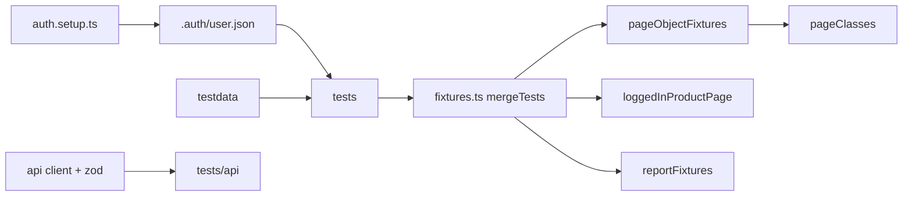

# Playwright TypeScript — Sauce Demo

Typed Playwright framework for [Sauce Demo](https://www.saucedemo.com/). The story this repo is meant to show: **storageState auth, reliable CI, tagged suites, and more than one test layer** (UI + API contracts + axe smoke).



## Quick start

```bash
cp .env.example .env
npm ci
npx playwright install --with-deps
npm test
```

`TEST_USER` and `TEST_PASS` are required for the setup project and any UI path that uses the standard user. The framework fails fast if they are missing.

## Scripts

| Script                    | What it runs                      |
| ------------------------- | --------------------------------- |
| `npm test`                | Chromium UI + API (local default) |
| `npm run test:smoke`      | `@smoke` on Chromium + API        |
| `npm run test:regression` | Chromium + Firefox + API          |
| `npm run test:headed`     | Chromium, headed                  |
| `npm run test:ui`         | Playwright UI mode                |
| `npm run report:allure`   | Generate and open Allure          |
| `npm run lint`            | ESLint                            |
| `npm run typecheck`       | `tsc --noEmit`                    |

## Tags

Tests declare Playwright tags. CI grep uses the same names.

| Tag           | Intent                                                                                      |
| ------------- | ------------------------------------------------------------------------------------------- |
| `@smoke`      | PR gate: login (including locked-out), sort A–Z, add to cart, checkout, API GET, login a11y |
| `@regression` | Full UI + API on push to main                                                               |
| `@api`        | JSONPlaceholder contract tests                                                              |
| `@a11y`       | axe-core smoke                                                                              |

## Projects

| Project    | Role                                                            |
| ---------- | --------------------------------------------------------------- |
| `setup`    | Logs in once, writes `.auth/user.json`                          |
| `chromium` | Authenticated UI (login specs opt out of storageState)          |
| `firefox`  | UI suite on push / `test:regression` (a11y stays Chromium-only) |
| `api`      | No browser session; JSONPlaceholder `request` context           |

Login specs call `test.use({ storageState: { cookies: [], origins: [] } })` so they still exercise the UI form.

## Environment

| Variable       | Used for                                   |
| -------------- | ------------------------------------------ |
| `TEST_USER`    | Standard user for `storageState` setup     |
| `TEST_PASS`    | Matching password                          |
| `ALLURE_OWNER` | Allure owner label (defaults to `qa-team`) |
| `CI`           | Retries, 2 workers, `forbidOnly`           |
| `GITHUB_SHA`   | Allure environment widget                  |

`.env` is gitignored. Commit `.env.example` only. In GitHub Actions, set repository secrets `TEST_USER` / `TEST_PASS`. The workflow falls back to the public Sauce Demo credentials so a fork still runs.

## CI

- PRs run `npm run test:smoke` inside `mcr.microsoft.com/playwright:v1.63.0-noble`.
- Pushes to `main` / `master` run `npm run test:regression` (Chromium + Firefox + API).
- Artifacts: Playwright HTML report, Allure results, generated Allure HTML.
- On push to default branches, Allure is published to GitHub Pages (`peaceiris/actions-gh-pages`). Enable Pages on the `gh-pages` branch after the first successful main run.

## Reports

- Playwright HTML: `playwright-report/` (also uploaded from CI).
- Allure results go to `allure-results/` (not the HTML folder). Generate locally with `npm run report:allure`.
- Screenshots and video are kept on failure; traces are collected on the first retry.

## Flake triage

Retries are **CI-only**. Local failures should reproduce on the first run.

1. Open the Playwright HTML report or Allure and jump to the failed step.
2. If CI retried, download the trace: `npx playwright show-trace test-results/.../trace.zip`.
3. Watch the retained video / screenshot. Prefer a missing wait or locator over adding a timeout.
4. Re-run the single spec headed: `npx playwright test tests/checkoutTest.spec.ts --project=chromium --headed`.
5. Do not add `waitForTimeout`. Wait on a role, `data-test`, or URL instead.

See [docs/test-strategy.md](docs/test-strategy.md) for layering, risk, and the axe exception policy.

## Why there is an API suite on a UI demo app

Sauce Demo has no public API. `tests/api` hits JSONPlaceholder through a small client with **zod schema checks** so the repo still shows the SDET pattern: API contracts beside UI flows. If a later app exposes setup APIs, the same client shape is where UI tests would create state.

Visual snapshots are intentionally omitted: inventory images and Sauce Demo CSS change enough that pixel diffs would be maintenance, not signal.
